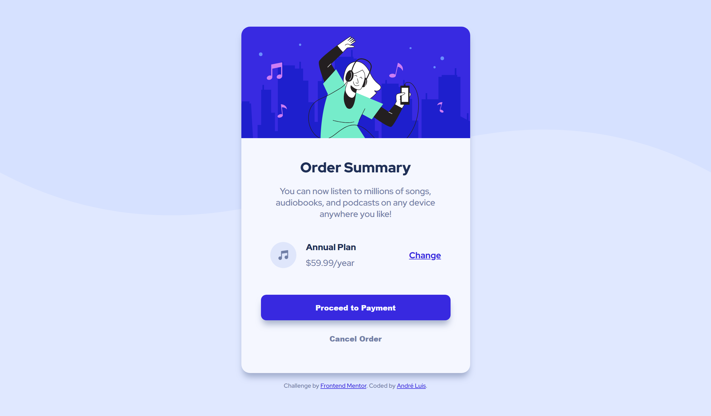

<h1 align="center"> Frontend Mentor - Order summary card solution </h1>

This is a solution to the [Order summary card challenge on Frontend Mentor](https://www.frontendmentor.io/challenges/order-summary-component-QlPmajDUj). Frontend Mentor challenges help you improve your coding skills by building realistic projects.

 

  <a href="#-tecnologias">Tecnologias</a>&nbsp;&nbsp;&nbsp;|&nbsp;&nbsp;&nbsp;
  <a href="#-projeto">Projeto</a>&nbsp;&nbsp;&nbsp;|&nbsp;&nbsp;&nbsp;
  <a href="#-screenshots">Screenshots</a>&nbsp;&nbsp;&nbsp;|&nbsp;&nbsp;&nbsp;
  <a href="#-links">Links</a>&nbsp;&nbsp;&nbsp;

 

## 🚀 Tecnologias

Esse projeto foi desenvolvido com as seguintes tecnologias:

- HTML e CSS

## 💻 Projeto

O desafio era construir esse card o mais próximo possível do design original.

## 📸 Screenshots

  

## 🌎 Links

...

- Solution: [https://www.frontendmentor.io/solutions/order-summary-component-html-css-K12xLQ49GS](https://www.frontendmentor.io/solutions/order-summary-component-html-css-K12xLQ49GS)
- Live Site: [https://order-summary-card-aandreluis.netlify.app/](https://order-summary-card-aandreluis.netlify.app/)

---
